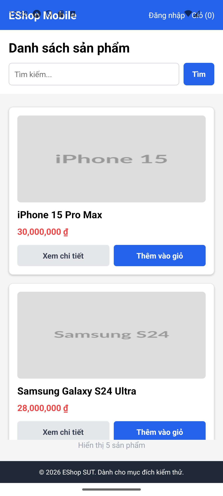

# Failure Modes — Maestro (Phạm Vũ Ngọc Duy — 23127183)

Demo video: https://www.youtube.com/watch?v=7_-sTxwdQvI

## Failure Mode 1 – Login/Cart Navigation Links Untappable on Pixel 8

| Field | Description |
|---|---|
| Failure Mode ID | FM-01 |
| Failure Mode | The "Đăng nhập" (Login) and "Giỏ" (Cart) links in the top navigation bar are completely untappable on a Pixel 8 emulator profile. |
| Related Requirement | FR-23 (Navigation Requirements — navbar); blocks access to FR-02 (Login) and FR-07 (Shopping Cart), since the navbar is the only entry point into those flows. |
| Description | On the Pixel 8 AVD, tapping "Đăng nhập" or "Giỏ" in the top navigation bar produces no reaction at all — neither through Maestro nor through a direct manual tap. `adb shell dumpsys window displays` shows the system status bar occupying `y = 0–132px` (roughly double the standard ~63px) because Pixel 8's centered camera cutout forces a taller reserved touch region, and the app's entire navigation bar renders inside that reserved zone. Root cause in the code: the app imports `SafeAreaView` from the core `"react-native"` package, which does not apply safe-area insets on Android (it is effectively iOS-only), combined with `"edgeToEdgeEnabled": true` in `app.json` — so the header content is drawn directly under the system status bar instead of being pushed below it. |
| Steps to Reproduce | 1. Run the app on a Pixel 8 (API 34) emulator via Expo Go. 2. Open the home screen ("Danh sách sản phẩm"). 3. Tap "Đăng nhập" or "Giỏ" in the top navigation bar. |
| Expected Result | Tapping "Đăng nhập" opens the login screen; tapping "Giỏ" opens the cart screen. |
| Observed Failure | No reaction occurs. Verified independently via `adb input tap` at the exact pixel coordinates of "Đăng nhập" — no reaction — while a tap on "Thêm vào giỏ" elsewhere on the same screen worked normally (confirmed by a "Thành công" success dialog). |
| Impact | High — the codebase provides no alternative path to the Login, Cart, or Profile screens other than this navigation bar (confirmed by inspecting every `setView("login")` / `setView("cart")` call site), so this defect fully blocks those flows on the affected device profile. On a Nexus 5X (no camera cutout, ~63px status bar), the same element remains tappable — the real-world severity is device-dependent. |
| Environment | Mobile application (Maestro Studio) — Pixel 8 / API 34 emulator, Expo Go (`host.exp.exponent`), `App.js` (`SafeAreaView` import, `edgeToEdgeEnabled` in `app.json`) |

*The affected navbar (`"Đăng nhập"` / `"Giỏ (0)"`) as rendered on the Pixel 8 profile. The tap failure itself has no visual signature in a static screenshot — it is a static-looking, correctly-rendered navbar that simply does not respond to touch — which is why the verification relied on `adb input tap` plus `adb shell dumpsys window displays` rather than a screenshot alone (see Observed Failure above).*

## Failure Mode 2 – Inconsistent UI Labels Across Screens

| Field | Description |
|---|---|
| Failure Mode ID | FM-02 |
| Failure Mode | The same action is labeled differently depending on the screen, which contradicts the documented UI-consistency requirement and causes text-based automation to fail on screens it was not written for. |
| Related Requirement | FR-21 (General UI Standards — consistent language: "the entire UI must use Vietnamese, except for standard technical terms"). |
| Description | Three inconsistencies were found: (1) the login submit button reads **"Sign In"** in English, inside an otherwise Vietnamese UI; (2) the add-to-cart button reads **"Thêm vào giỏ"** on the product list screen but **"Thêm vào giỏ hàng"** on the product detail screen; (3) the login screen title reads **"Đăng Nhập"** (capital N) while the navbar link that opens it reads **"Đăng nhập"** (lowercase n). This is a genuine content/design defect in the application, not a Maestro defect. |
| Steps to Reproduce | 1. Open the app and observe the "Đăng nhập" navbar link (lowercase n). 2. Tap it to open the login screen; observe the "Đăng Nhập" title (capital N) and the "Sign In" submit button. 3. Log in and go to the product list; observe the "Thêm vào giỏ" button. 4. Open a product's detail screen; observe the add-to-cart button label there. |
| Expected Result | The same action uses one consistent label everywhere in the app, and the display language is consistent throughout (per FR-21). |
| Observed Failure | The three inconsistencies described above were reproduced as stated. |
| Impact | Medium — does not block any business flow, but any text-based locator (including Maestro's `tapOn: "..."`) written for one screen fails when reused on an equivalent screen; a Maestro newcomer could mistake this for a tool/config problem rather than a genuine app bug. |
| Environment | Mobile application (Maestro Studio) — Expo Go (`host.exp.exponent`), `App.js` (Login, Product List, Product Detail screens) |

## Failure Mode 3 – MaestroGPT (AI-Generated Flow) Produces Incorrect, Non-Deterministic Output

| Field | Description |
|---|---|
| Failure Mode ID | FM-03 |
| Failure Mode | MaestroGPT generates an incorrect Maestro flow from a natural-language prompt, and produces a different, differently-wrong result each time the identical prompt is repeated. |
| Related Requirement | N/A — this is an AI-tool failure mode, not a violation of an EShop functional requirement. Recorded because Stage 4 requires auditing any AI-assisted test artefact before it is trusted. |
| Description | MaestroGPT (Maestro Studio's built-in AI) was asked to generate a flow from the same natural-language description ("log in with test@eshop.com / Test1234!, then go to the product list"), and the raw output was run as-is to expose its mistakes. The raw output ([`maestro/eshop/03_ai_generated_before.yaml`](../maestro/eshop/03_ai_generated_before.yaml)) has multiple concrete defects: a placeholder `appId` (`com.example.eshop`) instead of the real `host.exp.exponent`; no `tapOn: "frontend-mobile"` after `launchApp`, so the flow never actually leaves Expo Go's own project-selection screen; `inputText` called with no preceding `tapOn` on the Email/Mật khẩu fields, so it types into whatever is currently focused; submission via `pressKey: "Enter"` (hedged with an "(if necessary)" comment); a final tap on `"Product List"` — a label that does not exist anywhere in the Vietnamese UI (the real screen is titled "Danh sách sản phẩm"); and no `assertVisible` anywhere to confirm success. A hand-corrected version ([`maestro/eshop/03_ai_generated_after.yaml`](../maestro/eshop/03_ai_generated_after.yaml)) fixes all of these. Separately, repeating the identical prompt on another occasion produced a second, differently-wrong result: entirely invalid Maestro syntax (`steps:`, `tap:`, `type: ... into: ...`, `waitForElement:` — none of these are real Maestro commands; the real ones are `appId:`, `tapOn:`, `inputText:`, `assertVisible:`). This second attempt was observed and documented at the time but not saved as a file. |
| Steps to Reproduce | 1. Open MaestroGPT in Maestro Studio's Cloud tab. 2. Submit the prompt: "Open EShop app, login with email test@eshop.com and password Test1234!, then go to the product list." 3. Repeat the identical prompt on a separate occasion. 4. Inspect the generated YAML from each attempt without editing it, and try to run it. |
| Expected Result | A generated flow that runs against the real app (correct `appId`, real on-screen labels, valid Maestro syntax), consistently across repeated identical prompts. |
| Observed Failure | First occasion: wrong `appId`, missing steps, and a non-existent English label (see `03_ai_generated_before.yaml`). Second occasion: syntactically invalid Maestro commands. Neither raw attempt ran successfully; the two occasions also disagreed with each other despite an identical prompt. |
| Impact | Medium, caught before use — no automation or bug conclusion was based on the unverified AI output. The finding is that AI-generated test artefacts must be verified against the real application before being trusted, and that the same prompt can yield different, differently-wrong output on repeated asks. The `appId` and labels were corrected against the real app (verified via source and `adb`), and the corrected flow (`03_ai_generated_after.yaml`) was re-run and passed. |
| Environment | Maestro Studio — MaestroGPT (Cloud tab), Expo Go (`host.exp.exponent`) |
