# T03 Mobile Automation Testing — User Guide

**Course:** CS423 / CSC15003 — Software Testing  
**Seminar topic:** T03 — Mobile Automation Testing  
**Team:** Team 10  
**Traditional tool:** Appium 2 with UiAutomator2  
**AI-augmented / low-code direction:** Maestro Studio / Mobile.dev  
**System under test:** React Native EShop mobile application  
**Document status:** Stage S4 working draft  
**Last updated:** 11 July 2026  

## Team members

| Student ID | Full name |
|---|---|
| 23127159 | Phạm Lê Thái Bảo |
| 23127176 | Huỳnh Lê Khương Duy |
| 23127183 | Phạm Vũ Ngọc Duy |
| 23127446 | Phạm Chí Bảo Ninh |
| 23127531 | Chu Quốc Anh Minh |

---

# 1. Introduction

## 1.1 Purpose

This guide explains how to configure and use **Appium 2** and **Maestro Studio** to automate an Android build of a React Native EShop application.

The two tools are applied to the same business flow:

```text
Launch application
→ Log in
→ Search for a product
→ Open product details
→ Add the product to the cart
→ Verify the cart
```

Using the same scenario makes it possible to compare:

- Environment setup effort
- Test-authoring effort
- Script readability
- Execution time
- Stability and flake rate
- Diagnostic quality
- Maintenance effort after a UI change
- The value and risks of AI-assisted flow generation or repair

## 1.2 Why Appium and Maestro are paired

### Appium 2

Appium is the team's traditional automation tool. The test client sends WebDriver commands to an Appium server, and the server uses the **UiAutomator2** driver to control Android.

The team's Stage 3 Appium report used:

- Eclipse Temurin JDK 17
- Android Studio and Android SDK
- A locally installed Appium 2 package
- UiAutomator2 driver `8.0.1`
- WebdriverIO as the JavaScript client
- VS Code as the development environment

Installing Appium locally inside the repository makes the version reproducible for other team members and later CI execution.

### Maestro Studio

Maestro uses readable YAML flows rather than a JavaScript WebDriver client. The team's Stage 3 path used the native Windows **Maestro Studio** application, which provides an editor, a device view, step execution, and result display in one interface.

The tested Maestro environment recorded in the progress report was:

- Windows 11
- Pixel 8 Android Emulator
- Android 14, API level 34
- Google Play Intel x86_64 system image
- Maestro Studio for Windows
- YAML test flows

The team successfully ran a Contacts smoke test in Maestro Studio and recorded both steps as passing in approximately seven seconds.

## 1.3 Important terminology

| Term | Meaning in this guide |
|---|---|
| SUT | System Under Test — the React Native EShop |
| AVD | Android Virtual Device |
| ADB | Android Debug Bridge |
| Capability | Appium session setting such as platform, device, package, or activity |
| Locator | A strategy used to identify a UI element |
| Flow | A Maestro YAML test file |
| Assertion | A check that verifies an expected result |
| Test ID | A stable identifier exposed by the React Native UI |
| Failure mode | A situation in which the tool produces a wrong, incomplete, or misleading result |

## 1.4 Verified progress and remaining work

| Area | Current evidence | Status |
|---|---|---|
| Android SDK and Platform-Tools | Configuration screenshots exist | Partially verified across team machines |
| Maestro Studio installation | Studio workspace created | Verified |
| Maestro–emulator connection | `emulator-5554` shown in Studio | Verified |
| Maestro smoke test | Contacts flow shows PASS | Verified |
| Appium local package | Installed inside project | Verified |
| UiAutomator2 | Driver `8.0.1` listed as installed | Verified |
| Appium server | Local server screenshot exists | Verified |
| Appium smoke script | Executed 23 Jul 2026 on Pixel 8 AVD — PASS (`evidence/appium/smoke-test-log.txt`) | Verified |
| EShop Appium test | Real locators extracted from `App.js`; run pending build install | In progress |
| EShop Maestro test | Requires final app ID and element selectors | TODO |
| AI-assisted Maestro feature | Must be demonstrated and audited | TODO |

## 1.5 EShop information

| Item | Project value |
|---|---|
| Repository | https://github.com/ttbhanh/eshop-sut |
| Framework | Expo |
| Test account | test@eshop.com / Test1234! |

---

# 2. Installation

## 2.1 Recommended repository structure

```text
T03-Mobile-Automation/
├── mobile-app/
├── appium-tests/
│   ├── tests/
│   ├── artifacts/
│   ├── package.json
│   └── package-lock.json
├── maestro/
│   ├── smoke/
│   ├── eshop/
│   └── common/
├── assets/
│   └── screenshots/
├── evidence/
│   ├── appium/
│   ├── maestro/
│   └── ui-change-experiment/
├── User_Guide.md
└── README.md
```

## 2.2 Install Java and Node.js

Install:

- Eclipse Temurin JDK 17
- A Node.js version compatible with the selected EShop
- Git

Verify:

```powershell
java -version
node --version
npm --version
git --version
```

The Appium team report used JDK 17 and configured `JAVA_HOME`.

## 2.3 Install Android Studio and SDK components

Install Android Studio using the standard setup wizard.

Open:

```text
Android Studio
→ More Actions
→ SDK Manager
```

Install or confirm:

- Android SDK Platform
- Android SDK Build-Tools
- Android SDK Platform-Tools
- Android SDK Command-line Tools (latest)
- Android Emulator

The team's Maestro environment used Android 14 / API 34. The final API level should match the selected EShop and the environment verified by the whole team.

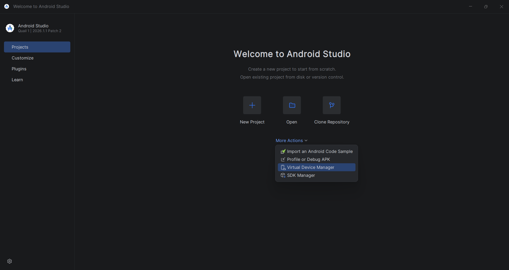

*Figure 1. Opening Android Studio tools from the Welcome screen.*

## 2.4 Configure Android environment variables

Locate the Android SDK folder. A common Windows location is:

```text
C:\Users\<username>\AppData\Local\Android\Sdk
```

Create:

```text
ANDROID_HOME=C:\Users\<username>\AppData\Local\Android\Sdk
```

Add these entries to `Path`:

```text
%ANDROID_HOME%\platform-tools
%ANDROID_HOME%\emulator
%ANDROID_HOME%\cmdline-tools\latest\bin
```

The Appium progress report also recorded older `tools` paths. Prefer the directories that actually exist in the installed SDK.

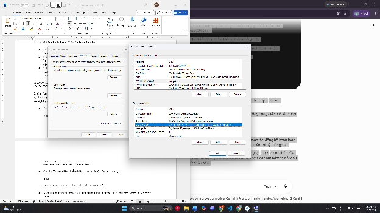

*Figure 2. Example Android environment-variable configuration from the Appium setup report.*

Close all terminals, open a new PowerShell window, and verify:

```powershell
echo $env:ANDROID_HOME
adb version
```

### When `adb` is not recognized

Check whether the executable exists:

```powershell
$Sdk = "$env:LOCALAPPDATA\Android\Sdk"
Test-Path "$Sdk\platform-tools\adb.exe"
```

If the result is `True`, temporarily update the current terminal:

```powershell
$env:ANDROID_HOME = $Sdk
$env:Path += ";$Sdk\platform-tools;$Sdk\emulator;$Sdk\cmdline-tools\latest\bin"
adb version
```

Then configure the same paths permanently in Windows Environment Variables.

If the result is `False`, install **Android SDK Platform-Tools** from SDK Manager.

## 2.5 Create and start an Android emulator

Open:

```text
Android Studio
→ More Actions
→ Virtual Device Manager
```

If the device list is empty, select **Create virtual device**.

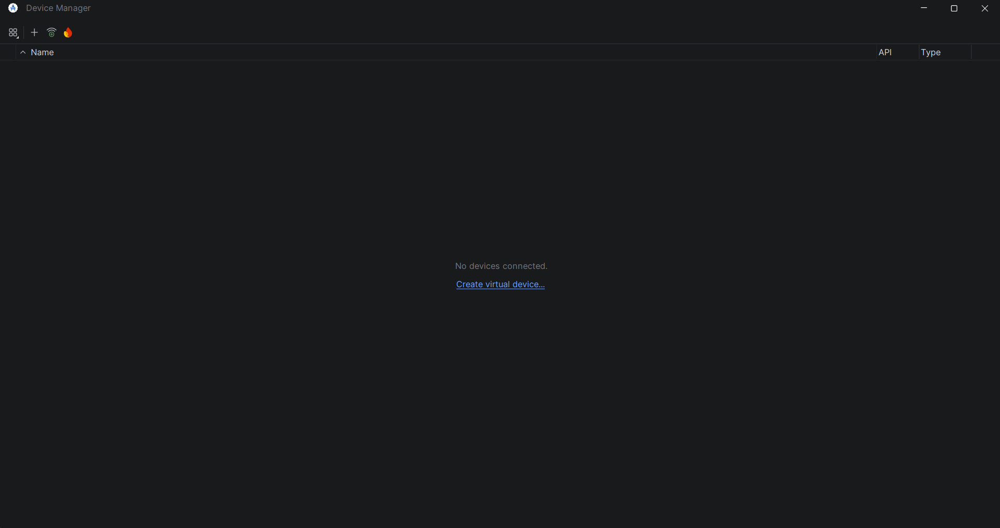

*Figure 3. Device Manager before an AVD is created.*

The tested Maestro setup selected **Pixel 8**:

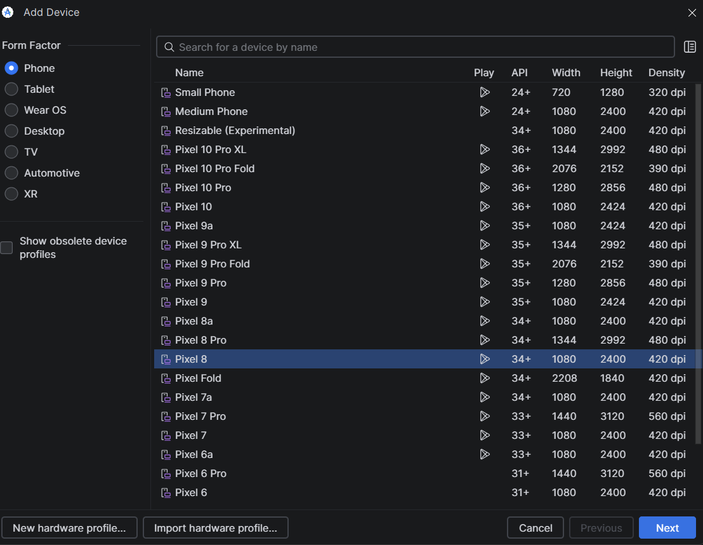

*Figure 4. Pixel 8 hardware profile selected for the seminar environment.*

Select an Android 14 / API 34 Google Play x86_64 image when it is compatible with the host machine and the selected EShop:

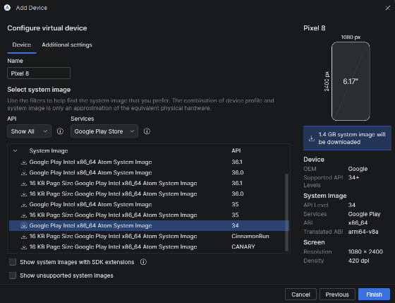

*Figure 5. API 34 system image used in the Maestro progress report.*

The Appium report also recorded the system-image configuration screen:

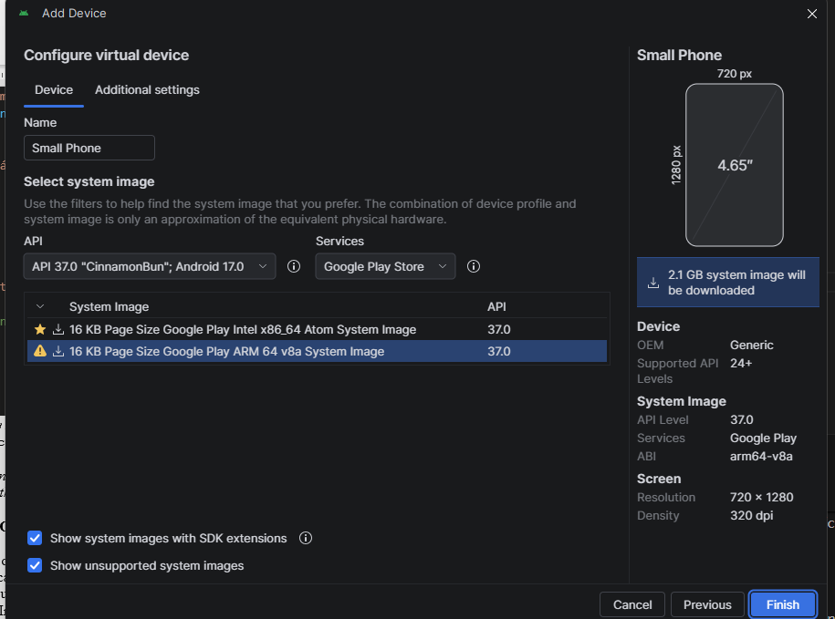

*Figure 6. AVD image-selection evidence from the Appium setup work.*

Start the emulator and verify:

```powershell
adb devices
```

Expected result:

```text
List of devices attached
emulator-5554    device
```

## 2.6 Install Appium locally

The team chose a local installation to avoid changing the global Node.js environment and to keep the project version reproducible.

Create the test project:

```powershell
mkdir appium-tests
cd appium-tests
npm init -y
npm install appium --save-dev
npm install webdriverio --save-dev
```

Install UiAutomator2:

```powershell
npx appium driver install uiautomator2
```

List installed drivers:

```powershell
npx appium driver list --installed
```

The progress report recorded:

```text
uiautomator2@8.0.1 [installed (npm)]
```

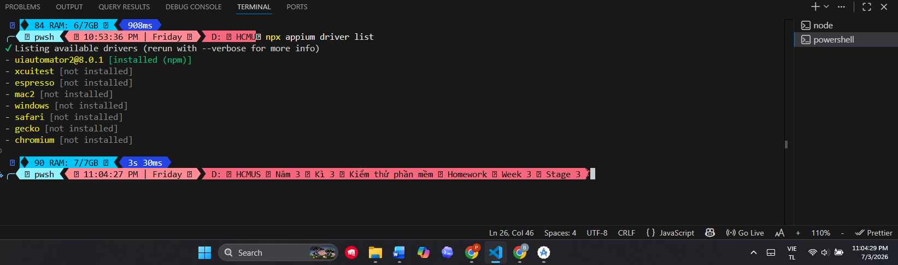

*Figure 7. UiAutomator2 listed as an installed Appium driver.*

Add scripts to `appium-tests/package.json`:

```json
{
  "scripts": {
    "appium": "appium",
    "test:smoke": "node tests/test_calculator.js",
    "test:eshop": "node tests/eshop_login_search.js"
  }
}
```

Start the local server:

```powershell
npm run appium
```

or:

```powershell
npx appium
```

Default server address:

```text
http://127.0.0.1:4723
```

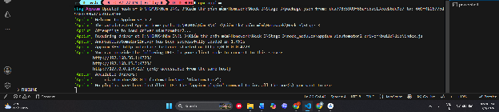

*Figure 8. Appium server started locally inside the project.*

## 2.7 Install Maestro Studio

The team used the Windows desktop application rather than requiring every member to begin with a CLI workflow.

Installation procedure recorded by the team:

1. Download `MaestroStudio.exe` from the Maestro documentation site.
2. Run the installer.
3. Start the Android emulator first.
4. Open Maestro Studio.
5. Select **New workspace**.
6. Choose the folder in which YAML flows will be stored.

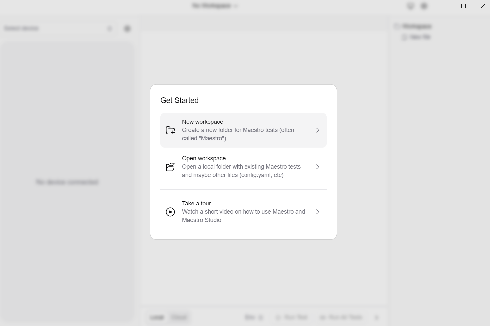

*Figure 9. Maestro Studio Get Started dialog.*

With the emulator already running, Maestro Studio should detect `emulator-5554` and display the device view:

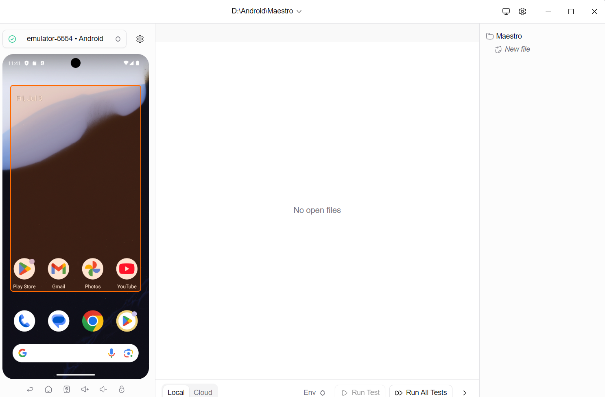

*Figure 10. Maestro Studio connected to the Android emulator.*

> The team's report states that this Studio workflow did not require WSL or a separate command-line workflow. If the team later adds Maestro CLI for CI, document and verify its prerequisites separately instead of assuming they are identical to Maestro Studio.

## 2.8 Clone and run the React Native EShop

The EShop SUT is vendored inside the team repository under `src/eshop-sut`
(upstream: https://github.com/ttbhanh/eshop-sut).

```powershell
git clone https://github.com/aohymevoL666/mobile-automation-testing
cd mobile-automation-testing\src\eshop-sut\frontend-mobile
npm install
```

The backend must also run, and the emulator must be able to reach it:

```powershell
cd ..\backend
npm install
node database.js   # first run only — seeds the SQLite database
node server.js     # keep running on http://localhost:3000

adb reverse tcp:3000 tcp:3000   # backend
adb reverse tcp:8081 tcp:8081   # Metro bundler
```

Use the correct command for the project.

### Expo development build

```powershell
npx expo run:android
```

### Bare React Native

```powershell
npx react-native run-android
```

### Existing APK

```powershell
adb install -r .\path\to\eshop.apk
```

Confirm that Login, Search, Product Details, and Cart are usable before automating them.

## 2.9 Determine the package and activity

Open the EShop on the emulator and run:

```powershell
adb shell dumpsys window | Select-String "mCurrentFocus"
```

Alternative:

```powershell
adb shell dumpsys activity activities |
  Select-String "mResumedActivity"
```

Recorded values for the EShop dev build (`expo run:android`, package declared
in `frontend-mobile/app.json`):

```text
APP_PACKAGE=com.eshop.mobile
APP_ACTIVITY=.MainActivity
```

The fully qualified activity is `com.eshop.mobile.MainActivity`.

## 2.10 Expose stable identifiers in React Native

Prefer stable accessibility identifiers instead of coordinates or long XPath expressions.

```tsx
<TextInput
  testID="email-input"
  accessibilityLabel="email-input"
  placeholder="Email"
/>

<Pressable
  testID="login-button"
  accessibilityLabel="login-button"
  onPress={handleLogin}
>
  <Text>Login</Text>
</Pressable>
```

Element map of the current EShop build (`frontend-mobile/App.js`). Only the
cart-related elements expose real `testID`s today; RN surfaces a `testID` as
the `resource-id` attribute in the UiAutomator2 hierarchy. All other elements
are located by visible text or by `EditText` order, because RN renders `Text`
as `android.widget.TextView` and `TextInput` as `android.widget.EditText`:

| Screen | Element | Locator used (UiAutomator2) |
|---|---|---|
| Login | Email field | `className("android.widget.EditText").instance(0)` — no testID; placeholder `Email` |
| Login | Password field | `className("android.widget.EditText").instance(1)` — no testID; placeholder `Mật khẩu` |
| Login | Login button | `text("Sign In")` |
| Home | Search field | `className("android.widget.EditText").instance(0)` — placeholder `Tìm kiếm...` |
| Search | First result | `text("Xem chi tiết").instance(0)`; assert product name via `textContains(...)` |
| Product card | Add-to-cart button | testID `add-to-cart-<productId>` → `resourceIdMatches(".*add-to-cart-.*")` |
| Product detail | Add-to-cart button | `text("Thêm vào giỏ hàng")` |
| Navbar | Cart link | testID `cart-nav` → `resourceIdMatches(".*cart-nav")` |
| Cart | Cart row | testID `cart-item-<productId>` |
| Cart | Quantity field | testID `cart-quantity-<productId>` |

Use Appium Inspector or Maestro Studio's screen-inspection feature to confirm the identifiers exposed by the built application. Adding `testID`s to the login and search elements (as in the snippet above) remains a recommended SUT improvement; the current suite works with text/order-based locators instead.

---

# 3. First Test

## 3.1 Maestro Studio smoke test — verified team example

Before using the EShop, the Maestro setup was validated against the Android Contacts application.

Create `maestro/smoke/test1.yaml`:

```yaml
appId: com.google.android.contacts
---
- launchApp
- assertVisible: "Contacts"
```

Important YAML rules:

- `appId` declares the Android package.
- `---` separates configuration from commands.
- `launchApp` starts the application.
- `assertVisible` checks that the expected text appears.
- Top-level commands must be aligned correctly. Incorrect indentation can produce a parse error.

Run the flow by selecting **Run Test** in Maestro Studio.

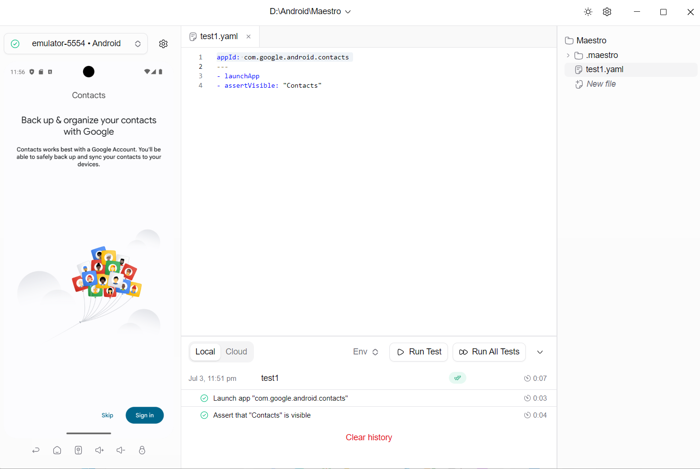

*Figure 11. The Contacts smoke test passed in Maestro Studio.*

## 3.2 Appium smoke-test template

Create `appium-tests/tests/test_calculator.js`:

```javascript
const { remote } = require("webdriverio");

const capabilities = {
  platformName: "Android",
  "appium:automationName": "UiAutomator2",
  "appium:deviceName": "Android Emulator",
  "appium:appPackage": "com.google.android.calculator",
  "appium:appActivity": "com.android.calculator2.Calculator"
};

const options = {
  hostname: "127.0.0.1",
  port: 4723,
  path: "/",
  logLevel: "info",
  capabilities
};

async function runTest() {
  let driver;

  try {
    driver = await remote(options);
    console.log(
      `PASS: ${capabilities["appium:appPackage"]} application opened.`,
    );
  } catch (error) {
    console.error("FAIL: Appium smoke test failed.", error);
    process.exitCode = 1;
  } finally {
    if (driver) {
      await driver.deleteSession();
    }
  }
}

runTest();
```

Run Terminal 1:

```powershell
cd appium-tests
npm run appium
```

Run Terminal 2:

```powershell
cd appium-tests
npm run test:smoke
```

> **Executed result (23 July 2026, Pixel 8 AVD, Android 14 / API 34 Google Play x86_64, WHPX):**
> the Google Calculator is not preinstalled on this system image, so the smoke
> test was executed against the preinstalled Settings app using the environment
> overrides supported by the script:
>
> ```powershell
> $env:APP_PACKAGE = "com.android.settings"
> $env:APP_ACTIVITY = ".Settings"
> npm run test:smoke
> # -> PASS: com.android.settings application opened.  (runtime 52.5 s, first
> #    run includes the on-device UiAutomator2 server installation)
> ```
>
> Evidence: `evidence/appium/smoke-test-log.txt` and
> `evidence/appium/smoke-test-screen.png`. The purpose of this smoke test —
> proving the WebdriverIO → Appium → UiAutomator2 → emulator chain end to end —
> is met regardless of which preinstalled application is opened.

## 3.3 First EShop end-to-end scenario

The Stage S4 first test should remain within 15 steps:

1. Start the emulator.
2. Confirm the device with `adb devices`.
3. Install or launch the EShop.
4. Reset the application to the required precondition.
5. Open the Login screen.
6. Enter a valid email.
7. Enter a valid password.
8. Tap Login.
9. Verify the Home screen.
10. Open Search.
11. Enter a product keyword.
12. Verify at least one matching result.
13. Open the result.
14. Add it to the cart.
15. Verify the selected item in the cart.

## 3.4 Appium EShop template

Final version of `appium-tests/tests/eshop_login_search.js`. It uses the Page
Objects from §4.4 (`appium-tests/pages/`) and the real locators from §2.10:

```javascript
const assert = require("node:assert/strict");
const fs = require("node:fs");
const path = require("node:path");
const { remote } = require("webdriverio");

const LoginPage = require("../pages/LoginPage");
const HomePage = require("../pages/HomePage");
const CartPage = require("../pages/CartPage");

const config = {
  appPackage: process.env.APP_PACKAGE || "com.eshop.mobile",
  appActivity: process.env.APP_ACTIVITY || ".MainActivity",
  email: process.env.TEST_EMAIL || "test@eshop.com",
  password: process.env.TEST_PASSWORD || "Test1234!",
  searchTerm: process.env.SEARCH_TERM || "iPhone",
  // Seeded product: id 1 = "iPhone 15 Pro Max" (backend/database.js).
  productId: process.env.PRODUCT_ID || "1",
  productName: process.env.PRODUCT_NAME || "iPhone 15 Pro Max",
};

async function runTest() {
  const driver = await remote({
    hostname: "127.0.0.1",
    port: 4723,
    path: "/",
    logLevel: "warn",
    capabilities: {
      platformName: "Android",
      "appium:automationName": "UiAutomator2",
      "appium:deviceName": "Android Emulator",
      "appium:appPackage": config.appPackage,
      "appium:appActivity": config.appActivity,
      // Cart and session live in component state, so a relaunch (below) is a
      // full reset; reinstalling via noReset:false is unnecessary.
      "appium:noReset": true,
      "appium:newCommandTimeout": 120,
    },
  });

  const artifactsDir = path.resolve(__dirname, "../artifacts");
  fs.mkdirSync(artifactsDir, { recursive: true });

  const login = new LoginPage(driver);
  const home = new HomePage(driver);
  const cart = new CartPage(driver);

  try {
    // Clean state: relaunch clears in-memory cart and session.
    await driver.execute("mobile: terminateApp", { appId: config.appPackage });
    await driver.execute("mobile: activateApp", { appId: config.appPackage });
    await home.waitLoaded();

    // Login
    await login.open();
    await login.login(config.email, config.password);
    await home.waitLoaded();

    // Search
    await home.search(config.searchTerm);
    const result = await home.productByName(config.productName);
    await result.waitForDisplayed({ timeout: 20000 });

    // Product detail -> add to cart
    await home.openFirstResult();
    await home.addToCartFromDetail();

    // Cart verification: right product, quantity 1.
    await cart.open();
    const item = await cart.cartItem(config.productId);
    await item.waitForDisplayed({ timeout: 20000 });
    assert.equal(await item.isDisplayed(), true);

    const name = await cart.itemByName(config.productName);
    assert.equal(await name.isDisplayed(), true);

    const quantity = await cart.quantityInput(config.productId);
    assert.equal(await quantity.getText(), "1");

    await driver.saveScreenshot(path.join(artifactsDir, "eshop-flow-pass.png"));
    console.log("PASS: EShop login, search, and cart flow.");
  } catch (error) {
    await driver.saveScreenshot(path.join(artifactsDir, "eshop-flow-fail.png"));
    throw error;
  } finally {
    await driver.deleteSession();
  }
}

runTest().catch((error) => {
  console.error(error);
  process.exitCode = 1;
});
```

Credentials above are the seeded demo accounts that ship with the SUT
(`src/eshop-sut/README.md`); no private credentials are committed. Use
environment variables to override any value.

## 3.5 Maestro Studio EShop template

Create `maestro/eshop/login-search-cart.yaml`:

```yaml
appId: TODO_APP_PACKAGE
name: EShop login, search, and cart
---
- launchApp:
    clearState: true

- tapOn:
    id: "TODO_EMAIL_ID"
- inputText: "TODO_TEST_EMAIL"

- tapOn:
    id: "TODO_PASSWORD_ID"
- inputText: "TODO_TEST_PASSWORD"
- hideKeyboard

- tapOn:
    id: "TODO_LOGIN_BUTTON_ID"

- assertVisible:
    id: "TODO_HOME_ID"

- tapOn:
    id: "TODO_SEARCH_ID"
- inputText: "backpack"
- hideKeyboard

- assertVisible:
    id: "TODO_FIRST_RESULT_ID"
- tapOn:
    id: "TODO_FIRST_RESULT_ID"

- tapOn:
    id: "TODO_ADD_TO_CART_ID"

- tapOn:
    id: "TODO_CART_ID"

- assertVisible:
    id: "TODO_CART_ITEM_ID"
```

Run the flow in Maestro Studio and capture:

- The YAML file
- The connected emulator
- The step list
- The pass/fail result
- Total execution time

## 3.6 Result table

Measured 23 July 2026 on the Pixel 8 AVD (Android 14 / API 34, Google Play
x86_64, WHPX acceleration), `com.eshop.mobile` dev build, backend on
`localhost:3000`. Maestro-side figures are the other team member's to record.

| Metric | Appium | Maestro Studio |
|---|---:|---:|
| Setup time | ~3–4 h (dominated by two one-off environment blockers, see below) | `TODO` |
| Authoring time | ~30–40 min for the 4 test/page-object files (247 non-empty lines) | `TODO` |
| Non-empty test lines | 247 (EShop suite: `eshop_login_search.js` + 3 Page Objects) / 38 (Calculator smoke test) | `TODO` |
| Median runtime over 5 runs | 42.8 s (raw: 40.7, 40.8, 42.8, 58.5, 59.9 s) | `TODO` |
| Unexpected failures / total runs | 0 / 5 (0% flake rate) | `TODO` |
| Main setup issue | Two genuine defects in the SUT itself blocked every run until fixed — see §5 | `TODO` |
| Main maintenance issue | UI-change repair (§4.10): ~3 min end-to-end for a one-line locator fix in one file | `TODO` |

The setup time is not representative of a typical Appium learning curve — most
of it went into diagnosing two SUT bugs that had nothing to do with Appium
itself: the Vietnamese/Unicode project path breaking the native (CMake/ninja)
Android build, an API-path mismatch that left every mobile screen non-functional
(BUG-04), and a header that rendered untappable under the status bar
(BUG-05). Once those were fixed, writing and stabilizing the actual Appium
Page Objects took well under an hour. Full details in §5 and
`bug-report/bug-report.md`.

---

# 4. Advanced Usage

## 4.1 Appium architecture

```text
JavaScript test
→ WebdriverIO client
→ Appium server
→ UiAutomator2 driver
→ Android emulator/device
→ React Native EShop
```

This separation gives Appium broad flexibility, but it also means that failures can originate in multiple layers.

## 4.2 Appium capabilities

Common Android capabilities:

| Capability | Purpose |
|---|---|
| `platformName` | Selects Android |
| `appium:automationName` | Selects UiAutomator2 |
| `appium:deviceName` | Human-readable device name |
| `appium:udid` | Targets a specific device serial |
| `appium:appPackage` | Identifies the installed Android application |
| `appium:appActivity` | Identifies the entry activity |
| `appium:noReset` | Controls whether state is retained |
| `appium:newCommandTimeout` | Controls session inactivity timeout |

Keep capabilities in one configuration file instead of duplicating them across tests.

## 4.3 Appium Inspector and locator strategy

The next Appium milestone in the team report was to inspect the final APK and identify element IDs or XPath expressions.

Preferred order:

1. Accessibility ID / stable test ID
2. Resource ID
3. Short, well-scoped Android UIAutomator selector
4. Text selector when the text is stable
5. XPath only when a more stable option is unavailable
6. Coordinates only for temporary diagnosis

A long XPath may break after a harmless UI layout change.

## 4.4 Page Object pattern

The suite implements three Page Objects in `appium-tests/pages/`:
`LoginPage.js`, `HomePage.js`, and `CartPage.js`. The real `LoginPage`:

```javascript
// appium-tests/pages/LoginPage.js
class LoginPage {
  constructor(driver) {
    this.driver = driver;
  }

  get emailInput() {
    return this.driver.$(
      'android=new UiSelector().className("android.widget.EditText").instance(0)',
    );
  }

  get passwordInput() {
    return this.driver.$(
      'android=new UiSelector().className("android.widget.EditText").instance(1)',
    );
  }

  get signInButton() {
    return this.driver.$('android=new UiSelector().text("Sign In")');
  }

  // Header link shown while logged out; navigates Home -> Login.
  get navLoginLink() {
    return this.driver.$('android=new UiSelector().text("Đăng nhập")');
  }

  async open() {
    const link = await this.navLoginLink;
    await link.waitForDisplayed({ timeout: 20000 });
    await link.click();
    await (await this.emailInput).waitForDisplayed({ timeout: 20000 });
  }

  async login(email, password) {
    await (await this.emailInput).setValue(email);
    await (await this.passwordInput).setValue(password);
    await (await this.signInButton).click();
  }
}

module.exports = LoginPage;
```

Benefits:

- One locator change can repair many tests.
- Test cases remain focused on user behavior.
- Repeated workflows are easier to maintain.

## 4.5 Explicit waits instead of fixed pauses

Avoid:

```javascript
await driver.pause(5000);
```

Prefer:

```javascript
const home = await driver.$(
  'android=new UiSelector().textContains("Danh sách sản phẩm")',
);
await home.waitForDisplayed({ timeout: 15000 });
```

The five-second pause in the initial Calculator example is acceptable for visual observation during a smoke test, but it should not become the main synchronization strategy for the EShop suite.

## 4.6 Maestro Studio workflow

The team-observed operational workflow is:

1. Start the Pixel 8 emulator.
2. Wait until the Android Home screen is fully loaded.
3. Open Maestro Studio.
4. Confirm that the emulator has a green connected indicator.
5. Open or create a YAML flow.
6. Run the flow.
7. Inspect each step's pass/fail status and execution time.

Unlike the Appium workflow, Maestro Studio does not require the team to start a separate Appium server or create a WebDriver client.

## 4.7 Inspect Screen

Maestro Studio's **Inspect Screen** feature can help the tester select a visible element and generate or refine a command.

Use it to:

- Inspect text and identifiers
- Reduce coordinate-based actions
- Confirm which element a command will target
- Build the first draft of a flow

A generated selector must still be reviewed for uniqueness and stability.

## 4.8 MaestroGPT / AI-assisted flow creation

The source report identifies **MaestroGPT** as an AI-assisted capability for describing a scenario in natural language and generating a YAML flow.

Recommended audit workflow:

1. Save the natural-language request.
2. Save the generated YAML unchanged.
3. Mark all generated selectors and assertions.
4. Compare them with the actual EShop screen hierarchy.
5. Run the generated flow.
6. Check whether the business result is asserted.
7. Record rejected or corrected commands.
8. Store the final student-edited flow separately.

Do not label the entire Maestro CLI or every YAML command as AI. The AI contribution is the specific generated or repaired artifact.

## 4.9 Reusable Maestro flows

Example reusable login flow:

```yaml
appId: ${APP_ID}
---
- tapOn:
    id: "TODO_EMAIL_ID"
- inputText: ${TEST_EMAIL}

- tapOn:
    id: "TODO_PASSWORD_ID"
- inputText: ${TEST_PASSWORD}
- hideKeyboard

- tapOn:
    id: "TODO_LOGIN_BUTTON_ID"

- assertVisible:
    id: "TODO_HOME_ID"
```

Reuse it from another flow:

```yaml
appId: TODO_APP_PACKAGE
---
- launchApp:
    clearState: true

- runFlow:
    file: ../common/login.yaml
    env:
      APP_ID: "TODO_APP_PACKAGE"
      TEST_EMAIL: "TODO_TEST_EMAIL"
      TEST_PASSWORD: "TODO_TEST_PASSWORD"
```

Confirm the exact syntax in the installed Maestro version before submission.

## 4.10 Controlled UI-change experiment

Perform each change in a separate Git commit.

### Change A — visible text

```text
"Add to Cart" → "Add item"
```

Check whether text-based Appium or Maestro selectors fail.

### Change B — identifier

```text
add-to-cart-button → product-add-button
```

Measure:

- Number of files affected
- Error-message quality
- Repair time
- Whether the test still verifies the same intent

> **Executed (23 July 2026).** Ran a text-label variant of Change B on the
> product-detail "Add to cart" button: `"Thêm vào giỏ hàng"` →
> `"Thêm sản phẩm"` (`App.js`, live-edited in the Metro-served copy — no
> rebuild needed since it's JS, not a resource ID).
>
> - **Detection:** `npm run test:eshop` failed immediately with
>   `element ("android=new UiSelector().text("Thêm vào giỏ hàng")") still not
>   displayed after 20000ms`, pointing straight at
>   `HomePage.js:59` (`detailAddToCartButton`) — no ambiguity about which
>   locator broke. Failure screenshot:
>   `evidence/appium/eshop-flow-fail.png` (button visibly reads "Thêm sản
>   phẩm").
> - **Repair:** one line changed in one file
>   (`pages/HomePage.js`'s `detailAddToCartButton` getter) — exactly the
>   benefit described in §4.4: the Page Object confines the fix to a single
>   place even though the button is used from one E2E flow.
> - **Repair time:** ~3 minutes from breaking the UI text to a confirmed
>   green rerun (`evidence/appium/ui-change-failure.log` →
>   `ui-change-repaired.log`), most of it re-running the full login → search →
>   cart flow rather than editing.
> - **Files affected:** 1 (`pages/HomePage.js`).
> - **Test intent preserved:** yes — same assertions (cart shows the right
>   product, name, and quantity) ran unchanged after the locator fix.

### Change C — delayed search response

Add a controlled delay before product results appear.

Compare:

- Appium explicit waits
- Maestro retry/wait behavior
- False-failure rate

### Change D — AI-generated repair

Use MaestroGPT or an approved AI repair feature on one intentionally broken flow.

Record:

- Original failing flow
- AI output
- Student review
- Final corrected flow
- Whether the repair preserved the requirement

## 4.11 Metrics

Run the same build on the same emulator when possible.

```text
Flake rate =
unexpected failures / repeated executions × 100%
```

Collect:

- Setup time
- Authoring time
- Runtime over at least five runs
- Lines of code
- Flake rate
- Repair time after each change
- Number of changed files
- Number of assertions
- AI suggestions accepted, edited, and rejected

---

# 5. Failure Modes

## 5.0 Real failures found while automating the EShop app (23 July 2026)

These were discovered running this suite, not invented for the report. Full
write-ups: `bug-report/bug-report.md` (BUG-04, BUG-05).

**A defect the SUT's own backend, not Appium.** Every mobile screen calls
`${API_URL}/products`, `/login`, etc. with `API_URL = "http://10.0.2.2:3000"`,
but every backend route lives under `/api/...`. Every request 404s, and the
app swallows the failure silently (products render as an empty list, no
error banner) because the error-detection code only checks for `<h1>` in the
response body, and Express's default 404 page uses `<pre>`. Nothing was
observably "broken" on screen — it just showed zero products, which itself is
a great example of a weak/absent negative-path assertion (§5.2) turning a
total API outage into a quiet empty state. Patched locally
(`API_URL` + `/api`) to unblock the demo; see BUG-04.

**A defect that makes login/cart physically untappable on Android.** The
header (Login / Cart links) renders under the transparent status bar because
`App.js` uses React Native's core `SafeAreaView` (iOS-only behaviour) together
with `edgeToEdgeEnabled: true`. Confirmed with three independent input paths —
Appium W3C Actions, `mobile: clickGesture`, and a raw `adb shell input tap` at
the exact `uiautomator dump` bounds — that a tap in that band never reaches
the app. This is not an automation artifact: a real finger would fail the
same way. Patched locally with `paddingTop:
14 + (RNStatusBar.currentHeight || 0)`; see BUG-05 for the proper
`react-native-safe-area-context` fix.

**Expo Dev Client chrome, not app UI.** A cold `app start` always shows the
Dev Client's own server-picker screen, then a one-time "developer menu"
bottom sheet on top of the freshly loaded bundle, before the actual EShop UI
is interactive. `eshop_login_search.js`'s `ensureDevClientLoaded()` polls for
the real home-screen header and only sends BACK when the dev-menu marker
text is confirmed present — an earlier version pressed BACK unconditionally
and ended up backgrounding the whole app. Worth remembering for anyone
automating an Expo dev build rather than a signed release APK.

**RN `Alert.alert()` isn't a W3C alert.** The add-to-cart success dialog
(`Alert.alert("Thành công", "Đã thêm vào giỏ hàng")`) is visibly a native
`AlertDialog` (confirmed via screenshot) but Appium's `acceptAlert()` reports
"no alert is present". Dismissing it by locating and tapping its "OK"
`TextView` like any other element works reliably.

## 5.1 Unstable locator causes a false failure

**Trigger:** Text, hierarchy, or identifier changes.

**Symptom:** Element-not-found error although the business function still works.

**Detection:**

- Inspect the current hierarchy.
- Compare selector matches.
- Review the screenshot at failure time.

**Mitigation:**

- Add stable React Native test IDs.
- Prefer accessibility or resource IDs.
- Avoid long XPath expressions and coordinates.

## 5.2 Weak assertion causes a false pass

**Trigger:** The test verifies only that a screen opened.

**Example:** Add-to-cart is tapped, but the test never checks the selected product, quantity, or subtotal.

**Mitigation:**

- Assert business state after every state-changing action.
- Include negative controls.
- Deliberately inject a defect and verify that the test detects it.

## 5.3 Application state leaks between tests

**Trigger:**

- Existing login session
- Cart items from a prior run
- Cached product data
- Incorrect `noReset` or `clearState` use

**Mitigation:**

- Define test preconditions.
- Use dedicated accounts.
- Reset only the state that should be isolated.
- Add cleanup flows.

## 5.4 Timing and network variability cause flaky results

**Trigger:** Slow emulator, API delay, animation, or network failure.

**Mitigation:**

- Use explicit conditions.
- Capture timestamps and logs.
- Avoid fixed sleeps as the default strategy.
- Separate application defects from test-environment failures.

## 5.5 AI-generated flow changes the test intent

**Trigger:** MaestroGPT or another AI feature generates or repairs a step.

**Risk examples:**

- It selects a different product with similar text.
- It removes an assertion.
- It replaces an identifier with a coordinate.
- It skips an important step.

**Mitigation:**

- Require human review.
- Keep generated and edited versions.
- Run a negative-control test.
- Link each assertion to the original requirement.

## 5.6 Tool reports success without meaningful validation

A smoke test that only launches an application proves that the environment can create a session. It does not prove that Login, Search, or Cart works.

The final seminar demo must include functional assertions on EShop behavior rather than only successful tool startup.

---

# 6. Troubleshooting

## 6.1 `adb` is not recognized

Error example:

```text
adb : The term 'adb' is not recognized as the name of a cmdlet...
```

Fix:

1. Install Android SDK Platform-Tools.
2. Set `ANDROID_HOME`.
3. Add `%ANDROID_HOME%\platform-tools` to `Path`.
4. Close and reopen the terminal.
5. Run:

```powershell
adb version
adb devices
```

## 6.2 Maestro Studio shows `No device connected`

The team observed that this commonly happened when Studio was opened before the emulator had fully started.

Fix:

1. Close Maestro Studio.
2. Wait until the emulator reaches the Android Home screen.
3. Run:

```powershell
adb devices
```

4. Reopen Maestro Studio.

If it still fails:

```powershell
adb kill-server
adb start-server
adb devices
```

If necessary, stop stale `adb.exe` processes in Task Manager first.

## 6.3 Maestro YAML parse error

Check:

- `---` is present after the flow configuration.
- List commands begin with `-`.
- Top-level lines use consistent indentation.
- Tabs were not mixed with spaces.
- Quotes are balanced.

Minimal valid example:

```yaml
appId: com.google.android.contacts
---
- launchApp
- assertVisible: "Contacts"
```

## 6.4 Appium installation fails with `ECONNRESET`

This was recorded during the local Appium setup and normally indicates interrupted package download.

Try:

```powershell
npm cache verify
npm install appium --save-dev
```

If necessary, use a stable network and retry. Do not claim the environment is complete until `npx appium --version` and the driver-list command succeed.

## 6.5 Appium installation fails with `EBUSY`

This may happen when a file or directory is locked.

Actions:

1. Stop Appium and Node.js processes.
2. Close terminals or editors using the directory.
3. Remove the incomplete dependency installation if safe:

```powershell
Remove-Item -Recurse -Force .\node_modules
Remove-Item -Force .\package-lock.json
npm cache verify
npm install
```

4. Retry the driver installation.

Preserve `package-lock.json` in the final working repository. Delete it only while repairing an incomplete local installation and regenerate it afterward.

## 6.6 UiAutomator2 is not installed

```powershell
npx appium driver list --installed
```

If missing:

```powershell
npx appium driver install uiautomator2
```

## 6.7 Appium cannot create a session

Check:

- The Appium server is running.
- Port `4723` is correct.
- `adb devices` lists a device.
- Package and activity values are correct.
- UiAutomator2 is installed.
- Capability names use the `appium:` prefix.

Find the foreground activity again:

```powershell
adb shell dumpsys activity activities |
  Select-String "mResumedActivity"
```

## 6.8 Appium cannot find an element

Check:

- The app is on the expected screen.
- The locator is not a placeholder.
- The element is visible and enabled.
- The identifier was exposed in the built React Native app.
- A loading overlay is not blocking input.

Use Appium Inspector and compare the actual hierarchy instead of only increasing the timeout.

## 6.9 Emulator is offline

```powershell
adb kill-server
adb start-server
adb devices
```

If still offline:

- Cold boot the AVD.
- Restart Android Studio.
- Verify virtualization support.
- Wipe AVD data only after confirming that no required test state will be lost.

## 6.10 Port 4723 is already in use

```powershell
netstat -ano | Select-String ":4723"
```

Stop the previous process or use another port:

```powershell
npx appium --port 4725
```

Update the WebdriverIO connection to the same port.

## 6.11 The EShop runs in Expo Go but is difficult to identify

Build a dedicated Android development build:

```powershell
npx expo run:android
```

Then identify the package and activity of that build rather than automating the Expo Go host package.

---

# 7. References

## 7.1 Team source material

1. `Appium Guide.docx.md` — Team member Stage 3 Appium environment report, 03 July 2026.
2. `Maestro_Guide.docx.md` — Team member Stage 3 Maestro Studio environment report, 03 July 2026.
3. `Tool_survey_proposal.md` — Team 10 T03 tool survey and selected pairing.
4. `T03_Mobile_Automation_Testing.docx.md` — Topic brief.
5. `Seminar_Workflow_Briefing.pptx.pdf` — Stage S4 structure and grading requirements.

## 7.2 Official technical references to verify before submission

- Appium documentation: https://appium.io/docs/
- Appium UiAutomator2 driver documentation: https://github.com/appium/appium-uiautomator2-driver
- WebdriverIO documentation: https://webdriver.io/
- Maestro documentation: https://docs.maestro.dev/
- Android Studio documentation: https://developer.android.com/studio
- Android Platform-Tools: https://developer.android.com/tools/releases/platform-tools
- React Native environment setup: https://reactnative.dev/docs/set-up-your-environment

Official repository and setup documentation of the selected EShop:

```text
EShop repository:  https://github.com/ttbhanh/eshop-sut
                   (vendored in this repo at src/eshop-sut)
EShop setup guide: src/eshop-sut/setup_guide.md
EShop spec (SRS):  src/eshop-sut/README.md
```

> AI use must be documented in the AI Audit and Disclosure. AI output is not an original technical source.

---

# Appendix A — Minimum test set

| ID | Scenario | Expected result | Appium | Maestro |
|---|---|---|---|---|
| TC-01 | Launch EShop | Initial screen appears | PASS | TODO |
| TC-02 | Valid login | Home screen appears | PASS | TODO |
| TC-03 | Invalid login | Error shown; user remains logged out | Not automated this pass | TODO |
| TC-04 | Search product | Matching result appears | PASS | TODO |
| TC-05 | Open product | Correct details appear | PASS | TODO |
| TC-06 | Add to cart | Correct item appears in cart | PASS | TODO |
| TC-07 | Update quantity | Quantity and subtotal change | Not automated this pass | TODO |
| TC-08 | Remove product | Product disappears | Not automated this pass | TODO |
| TC-09 | Logout | Login screen appears | Not automated this pass | TODO |

TC-01–TC-06 are exercised end-to-end by `appium-tests/tests/eshop_login_search.js`
(5/5 runs passing, §3.6). TC-03/07/08/09 are documented here as the natural
next scenarios but are outside this automation pass's scope — the existing
native suite already covers related ground (`tests/native/bugs.e2e.js` for an
invalid-login/lockout defect, `tests/native/cart.e2e.js` for cart merge
behaviour).

# Appendix B — Evidence checklist

## Environment evidence

- [x] JDK and Node.js versions — Temurin JDK 17.0.19, verified 23 Jul 2026
- [x] Android SDK and Platform-Tools — `%LOCALAPPDATA%\Android\Sdk`
- [x] `adb devices` — `emulator-5554  device`
- [x] AVD configuration — Pixel_8, Android 14 / API 34 Google Play x86_64, WHPX acceleration
- [x] Appium local version — appium@3.5.2 installed in `appium-tests` (npm)
- [x] UiAutomator2 installed — uiautomator2@8.1.1 (`npx appium driver list --installed`)
- [x] Appium server running — `http://127.0.0.1:4723` (see `evidence/appium/`)
- [ ] Maestro Studio installed (Maestro side — other team member's machine)
- [ ] Maestro connected to emulator (Maestro side — other team member's machine)

## Functional evidence

- [ ] Maestro Contacts smoke-test pass
- [x] Appium Calculator smoke-test pass — `evidence/appium/smoke-test-log.txt`, `smoke-test-screen.png`
- [x] Appium EShop flow pass — `evidence/appium/eshop-e2e-run1.log`…`run5.log`, `appium-tests/artifacts/eshop-flow-pass.png`
- [ ] Maestro EShop flow pass
- [x] Failure screenshot and log for each reproduced failure mode — `evidence/appium/debug-tap-*.png` (BUG-05), `ui-change-failure.log` + `appium-tests/artifacts/eshop-flow-fail.png` (§4.10)
- [x] Five-run runtime table — §3.6 (40.7/40.8/42.8/58.5/59.9 s)
- [x] Flake-rate calculation — 0/5 = 0% (§3.6)
- [x] UI-change repair-time evidence — §4.10 (`ui-change-failure.log` → `ui-change-repaired.log`, ~3 min)
- [ ] AI-generated flow and student-edited flow (Maestro/MaestroGPT side)

## Final review

- [ ] Every `TODO` is replaced or explicitly marked out of scope
- [ ] All test IDs match the final build
- [ ] No passwords, tokens, or student private data appear
- [ ] Every screenshot has a caption
- [ ] Every pass/fail statement has evidence
- [ ] Another team member followed the First Test section unaided
- [ ] AI-generated material was reviewed and disclosed
